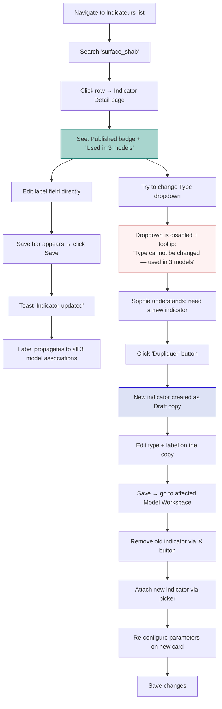
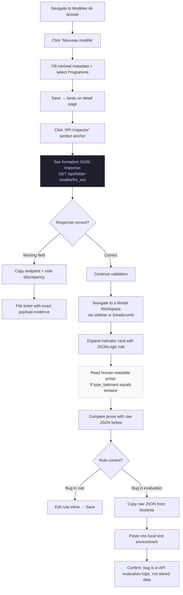

# UX Design Specification — Laureat Admin Interface

**Author:** Anthony
**Date:** 2026-03-03

---

<!-- UX design content will be appended sequentially through collaborative workflow steps -->

## Executive Summary

### Project Vision

The Laureat Admin Interface is an internal backoffice replacing raw API/Postman workflows for three tech-savvy operators who configure funding programs for local government collectivités. The platform's power lies in a configurable hierarchy — Funding Programs → Action Themes → Models → Indicator Models → Parameters → JSONLogic Rules — that currently has no human-facing layer. V1 delivers full CRUD across all 7 configuration entities with a focus on correctness, completeness, and operational confidence. Desktop-first, Angular 20, custom design system.

### Target Users

**Sophie (Business Analyst / Power User)** — The primary configurator. Builds entire program configurations end-to-end: creates indicators with types/subtypes, assembles action and folder models, attaches indicators to models, configures all 6 behavior parameters (required, visible, editable, default value, constraint, duplicable) per indicator per model context, writes JSONLogic rules for conditional behavior, and publishes through status workflows. Needs completeness, accuracy, and confidence that the full chain works correctly. Will use every feature of the interface.

**Alex (Product Manager / Validator)** — Creates and validates configuration objects. Uses the admin to confirm platform state matches specifications. Values speed, directness, and data fidelity. Needs to trust what the interface shows without cross-checking raw API responses.

**Dev Team (Read-mostly / Diagnostic)** — Occasional inspection of stored configuration objects. Values faithful data display with no abstraction loss. Uses the admin to diagnose issues (e.g., verifying stored JSONLogic rules) without context-switching to Postman.

### Key Design Challenges

1. **Progressive disclosure of genuine domain complexity** — The indicator parameter configuration surface (6 parameters × N indicators per model × conditional JSONLogic rules × bidirectional associations with metadata) is the densest UI in the system. Simple toggle operations must be instant; advanced rule configuration must be accessible without overwhelming the default view. The expandable card pattern (as seen in the existing platform UI reference) provides the foundation.

2. **Confidence over speed** — Users are technical operators who value correctness above efficiency. The breakthrough moment is the first time the full configuration chain (indicator → model → association → parameters → rules → publish) completes without errors and behaves correctly. Error handling must be explanatory ("Type cannot be changed once instances exist") not generic. Relationship visibility ("used in N models") is critical for safe editing.

3. **Consistent patterns across 7 entities of varying complexity** — The interface must feel predictable from Funding Programs (simple CRUD) through Indicator Models (complex parameter/rule/association management). Same layout rhythm, navigation patterns, and interaction conventions — with complexity escalating only where the domain requires it.

4. **JSONLogic as a first-class interaction** — Rules drive the parameter system (visibility, defaults, constraints). V1 uses a multi-line text field for raw JSON input. The UI must make rules readable and trustworthy even without syntax highlighting (v2 concern). Reference format (`section.technical_label`) and operator mappings must be clear to the user.

### Design Opportunities

1. **Model-as-workspace pattern** — ActionModel configuration is essentially form assembly: attaching indicators, configuring their behavior in-context, previewing the hierarchy. The admin can feel like a purpose-built form builder rather than a generic CRUD interface.

2. **Relationship transparency as a trust mechanism** — Surfacing connections ("This indicator is used in 3 models", "This rule references `mode_chauffe`") builds the confidence operators need to make changes without fear of downstream breakage.

3. **Established design language** — A comprehensive color palette with semantic tokens (text, stroke, surface, icons, status, brand) provides a ready-made foundation for a polished-but-sober internal tool aesthetic — matching the brief's "good effort/look balance" philosophy without requiring a heavy design system investment.

## Core User Experience

### Defining Experience

The core experience of the Laureat Admin Interface is **configuration authoring and stewardship**. Users spend their time in two complementary modes:

- **Building mode** — Creating indicators, assembling models, attaching indicators to models, configuring the 6 behavior parameters, writing JSONLogic rules, and publishing through status workflows. This is the intensive sprint work, primarily Sophie's domain.
- **Review/edit mode** — Navigating existing configuration, inspecting current state, spotting what needs adjustment, and editing in-place. This is the daily maintenance work shared by Sophie and Alex.

The ONE interaction to get right: **configuring an indicator within a model context** — the expandable card where Sophie sets required/visible/editable/default/constraint/duplicable, optionally adds JSONLogic rules, and sees immediately what she's built. If this interaction feels fluid and trustworthy, everything else follows.

### Platform Strategy

- **Desktop-first, mouse/keyboard** — Minimum 1280px viewport. No responsive or mobile layout for v1.
- **Web SPA** — Angular 20, accessed via desktop browser (Chrome primary, Firefox/Safari/Edge best-effort).
- **No offline capability** — All operations require live API connectivity.
- **Internal-only** — No public surface, no SEO, no accessibility certification requirements (though basic accessibility is good practice).
- **Keyboard efficiency matters** — Technical operators value keyboard shortcuts and tab-through for repetitive configuration tasks.

### Effortless Interactions

**Should feel invisible (zero friction):**
- CRUD on simple entities (Funding Programs, Action Themes, Communities, Agents) — forms that just work, no cognitive overhead
- Navigation between entity sections — sidebar always available, current location always clear
- Status transitions — one-click publish/disable/archive with clear confirmation
- Pagination — cursor-based, seamless, no user thought required
- Authentication — login once, stay logged in, token handled silently

**Should feel fluid (low friction, high control):**
- Indicator parameter toggles — ON/OFF with immediate visual feedback (as seen in the reference screenshot)
- Adding/removing indicator associations to a model — direct manipulation, not buried in forms
- Editing labels and descriptions — inline or quick-form, not a full page navigation

**Should feel supported (guided, not blocked):**
- JSONLogic rule input — plain text field with clear format guidance and reference syntax help
- Relationship-aware editing — "This indicator is used in 3 models" shown before making changes
- Constraint errors — explanatory, not cryptic ("Type cannot be changed once instances exist")

### Critical Success Moments

1. **The full-chain moment** (North Star) — Sophie creates an indicator, attaches it to an ActionModel, configures all 6 parameters with a JSONLogic rule on visibility, publishes the model — and it works. End-to-end. No Postman. No errors. *"Ship it."*

2. **The trust moment** — Alex opens a model detail, reads the indicator list and rules, and trusts what he sees matches the spec. He doesn't open Postman to double-check.

3. **The review moment** — Sophie returns to a previously configured model, scans the indicator list, spots that `surface_shab` has the wrong label, edits it in-place, saves. 30 seconds. No anxiety about breaking downstream references.

4. **The diagnostic moment** — A developer opens an indicator association, reads the stored JSONLogic rule in plain view, copies it for local testing. Five minutes, no context switching.

### Experience Principles

1. **Correctness is the experience** — Every interaction must reinforce confidence that what's configured is what's stored. No silent failures, no ambiguous states, no abstraction that hides the truth.

2. **Simple things simple, complex things possible** — Funding Programs are a form. Indicator parameter configuration is an expandable, rule-capable card system. Same admin, different depths — complexity emerges only where the domain demands it.

3. **Configuration is a workspace, not a wizard** — Sophie doesn't follow a linear flow. She jumps between indicators, models, and associations. The UI supports non-linear exploration and in-context editing, not step-by-step wizards.

4. **Show the relationships** — Every entity exists in a web of connections. Surfacing these connections (which models use this indicator, which rules reference this field, what status is this in) is not a nice-to-have — it's the foundation of editing confidence.

5. **Respect the operator** — These users are technical, domain-expert operators. No hand-holding tooltips on obvious actions. No confirmation dialogs on reversible operations. Reserve guardrails for genuinely destructive or irreversible actions.

## Desired Emotional Response

### Primary Emotional Goals

**Confident control** — The dominant emotional state. Users should feel assured that they know exactly what's happening, trust what they see, and are in charge of the configuration. This is a power tool wielded by domain experts — it should feel like one.

**Supported competence** — The admin respects users' expertise while providing just enough guidance on complex interactions (JSONLogic rules, constraint syntax, reference formats) to prevent errors without patronizing.

**Professional calm** — A clean, sober aesthetic that communicates reliability. No visual noise, no unnecessary animation, no playful UI metaphors. The interface stays out of the way and lets the work speak.

### Emotional Journey Mapping

| Moment | Target Emotion | Design Implication |
|--------|---------------|-------------------|
| First login | **Clarity** — "Clean, professional, I can find what I need" | Minimal onboarding, clear sidebar navigation, obvious entry points per entity |
| Creating a simple entity | **Effortlessness** — "That just worked" | Streamlined forms, smart defaults, instant save confirmation |
| Configuring indicator parameters | **Transparency** — "I see everything at a glance" | Expandable card pattern with all 6 parameters visible, toggle states obvious |
| Writing a JSONLogic rule | **Supported competence** — "I know the format, the field helps me" | Reference syntax hints, clear field labeling, format guidance nearby |
| Publishing a full model | **Accomplishment + confidence** — "It's done, it's correct" | Clear success confirmation, visible status change, relationship summary |
| When something goes wrong | **Informed, not frustrated** — "I understand what happened" | Explanatory error messages with cause and resolution, never cryptic codes |
| Returning the next day | **Familiarity** — "Everything's where I left it" | Persistent navigation state, predictable layout, consistent patterns |

### Micro-Emotions

**Actively cultivate:**
- **Confidence** — reinforced through data fidelity, relationship visibility, and explanatory feedback
- **Trust** — built by showing exactly what the API stores, no abstraction that hides truth
- **Accomplishment** — felt when a full configuration chain completes without errors
- **Ease** — experienced on simple entities where CRUD is invisible in its simplicity

**Actively prevent:**
- **Anxiety** ("Did I break something?") — mitigated by showing relationship context before edits ("used in 3 models")
- **Doubt** ("Is this what's actually stored?") — mitigated by faithful data display and API inspector
- **Frustration** ("Why won't it let me?") — mitigated by constraint messages that explain *why*, not just *what*
- **Overwhelm** ("Too much on screen") — mitigated by progressive disclosure: collapsed by default, expanded on demand

### Design Implications

- **Confident control** → Clean layout with strong visual hierarchy. Status badges prominent. Actions clearly labeled. No ambiguous icons without text.
- **Supported competence** → Contextual help for complex fields (JSONLogic syntax, reference format) shown inline, not in modals or external docs. Available but not intrusive.
- **Transparency** → Expandable indicator cards show all 6 parameter states at a glance. Toggle states use clear ON/OFF visual language with the brand color palette (`brand-primary` #1400cc for active states).
- **Informed errors** → Error messages follow the pattern: *what happened* + *why* + *what to do*. Example: "Type cannot be changed — instances of this indicator already exist. Create a new indicator instead."
- **Professional calm** → Surface colors from the palette (`surface-background-empty`, `surface-background-subtle`, `surface-background-slight`) create a quiet, layered visual hierarchy. Status colors are semantic and restrained.

### Emotional Design Principles

1. **Earn trust through truthfulness** — Never abstract, summarize, or hide what the API stores. If the data is complex, show it faithfully and help the user parse it — don't simplify it away.

2. **Quiet competence over flashy delight** — No celebratory animations, no gamification, no unnecessary transitions. Success feedback is clear and immediate (a toast, a status badge change) but never theatrical.

3. **Errors are conversations, not roadblocks** — Every error state is an opportunity to maintain confidence. The message explains the situation, the cause, and the path forward.

4. **Progressive calm** — Default views are clean and scannable. Complexity reveals itself on demand (expand a card, open a rule field, inspect an API response). The user controls the depth.

## UX Pattern Analysis & Inspiration

### Inspiring Products Analysis

**Strapi (Content Type Builder)** — The closest functional analog. Strapi's content type builder lets admins define fields, attach them to content types, and configure field behavior (required, unique, min/max, default values) through expandable field cards with toggle parameters. This is almost exactly the indicator-in-model configuration pattern Sophie needs. What works: progressive disclosure through collapsible field panels, clear parameter toggles, inline configuration without page navigation. What doesn't: Strapi's field configuration lacks rule-based conditional logic — it's always static ON/OFF. The Laureat admin must go further with JSONLogic-driven parameters.

**Linear** — The emotional and aesthetic benchmark. Linear demonstrates that an information-dense, power-user tool can feel calm, professional, and fast. Keyboard-first navigation, minimal chrome, strong typography hierarchy, and status management that communicates state through color without visual noise. Linear's sidebar + list + detail panel layout is a proven pattern for entity management. The emotional tone — confident, quiet, no-nonsense — maps directly to our design principles.

**Retool** — The "admin workspace" pattern. Retool's approach to internal tools demonstrates how to handle multiple entity types with a consistent navigation structure while allowing entity-specific complexity where needed. Sidebar navigation to entity sections, structured forms for CRUD, relationship dropdowns for connected entities. The density is right for technical operators who want to see data, not decoration.

**Django Admin / Laravel Nova** — The "predictable CRUD" baseline. These admin generators establish the universal pattern: entity list (paginated table) → entity detail → edit form → back to list. Every entity follows the same rhythm, which creates instant familiarity. This is the floor — our simple entities (Funding Programs, Action Themes, Communities, Agents) should feel this predictable. The limitation: they treat every entity identically, with no awareness of domain complexity. The Laureat admin must transcend this for Indicator Models and model-indicator associations.

### Transferable UX Patterns

**Navigation Patterns:**
- **Persistent sidebar with entity sections** (Linear, Retool) — All 7 entities accessible at all times. Current section highlighted. No nested menus for v1. Sophie should never be more than one click from any entity list.
- **List → Detail → Edit flow** (Django Admin) — The universal admin pattern. Paginated table → click row → detail view → edit in-place or via form. Predictable across all entities.
- **Breadcrumb trail** (Strapi) — For deep navigation paths (Model → Indicator Association → Parameter Configuration), breadcrumbs maintain orientation without requiring sidebar clicks.

**Interaction Patterns:**
- **Expandable card with inline configuration** (Strapi field builder) — The indicator parameter pattern. Each indicator in a model is a card that expands to reveal its 6 parameters as toggle rows. Configuration happens in-context, not in a separate page or modal. Directly inspired by the existing platform UI (reference screenshot).
- **Toggle with optional rule expansion** — Each parameter toggle (ON/OFF) has an optional "+ Add rule" action that reveals a JSONLogic input field. Default state is clean; complexity appears on demand.
- **Inline status transitions** (Linear) — Status changes happen via a dropdown or button directly in the detail view, not through a separate workflow page. One click: draft → published. Confirmation only for irreversible transitions.
- **Toast notifications for feedback** (universal) — Non-blocking success/error messages. Appear, persist briefly, auto-dismiss. No modal interruptions for routine operations.

**Visual Patterns:**
- **Strong typography hierarchy** (Linear) — Use font weight and size (not color alone) to create scannable layouts. Entity titles bold and prominent, metadata secondary, technical labels monospace.
- **Status badges with semantic color** (universal) — Draft (neutral), Published (success green `#2e8b7a`), Disabled/Archived (muted `#c8c8c8`). Small, clear, always visible in both list and detail views.
- **Quiet surface layering** (Linear) — Background tones from the palette (`surface-background-empty` → `surface-background-subtle` → `surface-background-slight`) create depth without borders. Cards sit on subtle backgrounds; active/selected states use `surface-active` (#dde2f5).

### Anti-Patterns to Avoid

- **Generic CRUD syndrome** — Treating Indicator Models the same as Funding Programs. The UI pattern must *escalate* with domain complexity, not flatten it.
- **Modal hell** — Opening modals for every edit, confirmation, or association. Modals break flow. Use inline editing and expandable panels instead. Reserve modals for destructive confirmations only (delete entity).
- **Wizard flows for non-linear work** — Sophie jumps between indicators, models, and associations. Step-by-step wizards assume a linear path that doesn't match her workflow. The workspace pattern (everything accessible, nothing locked behind "next") is essential.
- **Icon-only actions** — Technical operators scanning quickly need text labels, not ambiguous icons. Every action button should have a label, at minimum on hover.
- **Over-confirmation** — Confirming every save, every toggle, every status change. Only confirm destructive or irreversible operations (delete, type changes on published indicators). Routine saves get a quiet toast, nothing more.
- **Hidden relationships** — Not showing how entities connect. If Sophie edits an indicator label and it's used in 5 models, she must know *before* she saves, not after something breaks.

### Design Inspiration Strategy

**Adopt directly:**
- Persistent sidebar navigation with entity sections (Linear/Retool pattern)
- List → Detail → Edit flow with paginated tables (Django Admin baseline)
- Expandable indicator cards with toggle parameters (Strapi field builder pattern, validated by existing platform UI)
- Toast notifications for non-blocking feedback
- Status badges with semantic color from the established palette

**Adapt for our domain:**
- Strapi's static field configuration → extend with JSONLogic rule expansion on each parameter toggle
- Linear's status dropdown → adapt for the specific draft → published → disabled/archived workflow with API-driven transitions
- Django Admin's uniform entity treatment → maintain the pattern for simple entities, elevate for Indicator Models and model-indicator associations
- Retool's relationship dropdowns → enhance with "used in N models" metadata and association panels for bidirectional indicator-model links

**Avoid deliberately:**
- Material Design / PrimeNG component library aesthetic (too generic, too heavy for a custom internal tool)
- Consumer-app patterns (onboarding tours, gamification, celebratory animations)
- Wizard-based configuration flows (wrong for non-linear power-user workflows)
- Modal-heavy interaction patterns (breaks flow in configuration-dense contexts)

## Design System Foundation

### Design System Choice

**Tailwind CSS + Angular CDK** — A utility-first CSS framework paired with Angular's headless component primitives. Tailwind provides the styling layer with full visual control; Angular CDK provides production-grade interaction behavior (overlays, focus management, keyboard navigation, accessibility) without visual opinions.

This is a **custom-lightweight** design system: hand-crafted visually, framework-assisted behaviorally.

### Rationale for Selection

1. **Visual sovereignty** — The established color palette (60+ semantic tokens across text, stroke, surface, icons, status, brand) maps directly to Tailwind custom theme tokens. Every component reflects the project's identity, not a library's defaults.

2. **AI-assisted development fit** — Tailwind's utility classes are predictable, composable, and fast to generate. No time spent overriding opinionated component library styles. The developer (AI-assisted) can focus on domain logic rather than CSS specificity battles.

3. **Information density** — Tailwind naturally supports the tight, data-rich layouts this admin requires (indicator cards with 6 parameter rows, paginated tables with status badges, association panels). Component libraries like PrimeNG or Material fight back when you try to increase density beyond their design assumptions.

4. **Angular CDK for the hard parts** — Overlay positioning (dropdowns, dialogs, tooltips), focus trapping (modals), keyboard navigation (list selection), and ARIA patterns are genuinely difficult to implement correctly. CDK provides these behaviors without imposing visual style — exactly what a custom design system needs.

5. **Clean v1 → v2 path** — Tailwind utility classes and CDK behaviors are stable primitives. Polishing the UI in v2 (animations, refined spacing, advanced interactions) requires editing Tailwind config and component templates — no migration, no library version conflicts.

6. **Consistency at scale** — Tailwind's constraint-based system (fixed spacing scale, color tokens, font sizes) naturally prevents visual drift across 7 entity modules built over multiple development phases.

### Implementation Approach

**Tailwind Configuration:**
- Extend the default theme with the full project color palette as custom colors (e.g., `brand-primary`, `surface-background-subtle`, `status-draft`, `text-link`)
- Define a spacing and typography scale that supports information-dense layouts
- Configure `@apply` patterns for recurring component styles (button variants, badge variants, card patterns)

**Angular CDK Usage:**
- `@angular/cdk/overlay` — Dropdown menus, dialog positioning, toast placement
- `@angular/cdk/a11y` — Focus trapping in modals, focus monitoring for keyboard navigation
- `@angular/cdk/portal` — Dynamic content rendering for dialogs and overlays
- `@angular/cdk/collections` — Selection model for multi-select patterns (indicator association)

**Reusable Component Library (built in Phase 1):**
- `PaginatedTableComponent` — Cursor-based pagination, sortable columns, row click navigation
- `FormShellComponent` — Consistent form layout wrapper for create/edit views
- `ConfirmDialogComponent` — CDK overlay-based confirmation for destructive actions
- `StatusBadgeComponent` — Semantic color badges (draft, published, disabled, archived)
- `ToastComponent` — Non-blocking notification overlay (success, error, info)
- `ToggleRowComponent` — Parameter toggle with optional rule expansion (the indicator card building block)

### Customization Strategy

**Design Tokens (Tailwind theme):**
- All 60+ color tokens from the palette mapped to Tailwind custom colors
- Typography scale: primary font (system sans-serif for speed), monospace for technical labels and JSONLogic
- Spacing: 4px base grid, optimized for dense admin layouts
- Border radius: minimal (2-4px) — professional, not playful
- Shadow: subtle, single-level — cards lift slightly from surface, no dramatic elevation

**Component Patterns:**
- **Simple entities** (Funding Programs, Action Themes, Communities, Agents): Standard CRUD shell — table + form + detail view. Same layout, same rhythm, minimal customization.
- **Complex entities** (Action Models, Folder Models): CRUD shell + relationship panels (association dropdowns, linked entity lists).
- **Indicator Models**: CRUD shell + expandable card system with toggle parameters + JSONLogic rule fields + bidirectional association management. The most custom surface, built on the same primitives.

**Progressive Complexity:**
- Phase 1 builds the core component library with simple entity patterns
- Phase 2 validates the patterns with Action Themes (adds status workflow)
- Phase 3 extends with relationship panels (Action Models, Folder Models)
- Phase 4 adds the indicator card system — the most complex surface, built on 3 phases of established patterns

## Defining Interaction

### The Defining Experience

**"Open a model, see its indicators, configure their behavior — all in one place."**

The Laureat Admin's core interaction is the **model-as-workspace** pattern. Sophie opens an ActionModel and sees the list of attached indicators as expandable cards. She taps one open — the 6 behavior parameters are right there: toggles, optional rule fields, current values. She configures, adjusts, reviews. When satisfied, she saves. No page navigation. No modal chains. No Postman. The model *is* the workspace.

This interaction, if nailed, makes everything else follow: simple entities use the same list → detail → edit pattern (just simpler); complex entities extend it with the indicator card system. The entire admin is one interaction pattern at different depths.

### User Mental Model

**Sophie thinks in hierarchies, not forms.** Her mental model — built through months of raw API work — is:

- **Models** are containers that define what a user sees
- **Indicators** are reusable building blocks she attaches to models
- **Parameters** are behavior switches that adapt an indicator to a model context
- **Rules** are conditional logic that drives parameters dynamically

She doesn't think "I'm filling out a form." She thinks *"I'm assembling a form and defining its behavior."* The admin must match this mental model exactly — presenting models as workspaces where indicators are arranged and configured, not as flat CRUD records.

**Current workflow (Postman):** Sophie crafts a POST to create an indicator, then a PATCH to associate it to a model, then another PATCH to configure each parameter, then a POST to add a JSONLogic rule. Each operation is isolated — she holds the full picture in her head. The admin must externalize this mental picture: show the hierarchy visually, show the connections explicitly, let her work within the context of a model rather than across disconnected API calls.

**Alex's mental model is simpler:** He thinks "I want to see what's configured and confirm it matches the spec." His interaction is read-heavy: open model, scan indicator list, check parameters, verify rules. The same workspace view serves him — he just doesn't expand and edit.

### Success Criteria

**The interaction succeeds when:**

1. Sophie opens a model and *immediately sees* which indicators are attached, with collapsed summaries showing key parameter states (e.g., "Required, Visible, Default: #HGD55")
2. She expands an indicator card and all 6 parameters are visible as toggle rows — no secondary navigation
3. She toggles parameters, adds a rule, adjusts values — all within the same view
4. She reviews her changes before committing — unsaved changes are visually indicated
5. She clicks Save — changes persist, toast confirms, card reflects the new state
6. She publishes the model — status transitions with one action, badge updates immediately

**The interaction fails when:**

- Configuring parameters requires navigating away from the model view
- The collapsed indicator list doesn't show enough summary info (forces expand-all just to scan)
- Changes auto-save on every toggle (removes the safety net for experimentation)
- The JSONLogic rule field is in a separate screen or modal
- Saving provides no clear feedback about what changed

### Save Model

**Explicit save with unsaved-state awareness.** Changes within a model's indicator parameter configuration accumulate in the UI until the user explicitly saves. This reinforces the "confident control" emotional goal — Sophie can experiment with toggles and rules, make mistakes, undo changes by simply not saving, and commit only when she's satisfied.

**Design implications:**
- **Unsaved indicator** — Visual cue on the indicator card (e.g., subtle dot or border change) when parameters have been modified but not saved
- **Save button** — Prominent, always visible when unsaved changes exist. Disabled when nothing has changed.
- **Discard option** — "Discard changes" available alongside save, resetting to last-saved state
- **Navigation guard** — If Sophie navigates away with unsaved changes, a gentle prompt: "You have unsaved changes on 2 indicators. Save or discard?"

### Novel vs. Established Patterns

**Primarily established patterns, domain-adapted:**

The core interactions are all proven admin patterns — tables, forms, toggles, expandable cards, status badges. Nothing requires user education. Sophie and Alex will recognize every pattern from tools they've used before.

**The novel element is the combination:**

No off-the-shelf admin tool combines expandable indicator cards + 6-parameter toggle rows + inline JSONLogic rule input + bidirectional model-indicator associations + status workflow — in a single workspace view. This specific assembly is unique to the Laureat domain. But every individual piece is familiar.

**No new interaction metaphors needed.** The innovation is in the *domain awareness*, not the *interaction design*. The admin knows what a model-indicator-parameter-rule chain is and presents it naturally — that's the differentiator, not a novel swipe gesture or drag-and-drop metaphor.

### Experience Mechanics

**1. Initiation — Opening the workspace:**
- Sophie navigates to Action Models in the sidebar → paginated table of models
- She clicks a model row → model detail view opens
- The detail view shows: model metadata (top), attached indicators (main content area as expandable cards), actions (publish/archive in header)

**2. Interaction — Configuring indicators:**
- Each attached indicator appears as a **collapsed card** showing: indicator label, technical label, type badge, and parameter summary icons (which of the 6 are active)
- She clicks a card → it **expands** to reveal 6 parameter rows, each with:
  - Parameter label (Obligatoire, Non éditable, Non visible, Valeur par défaut, Duplicable, Valeurs contraintes)
  - ON/OFF toggle
  - "+ Ajouter une règle" link (reveals JSONLogic text field when clicked)
  - Current rule content (if a rule exists, shown inline)
- She toggles parameters, types rule JSON, adjusts default values
- Modified cards show an **unsaved indicator** (visual cue)

**3. Feedback — Knowing what's happening:**
- Toggle changes are reflected immediately in the UI (optimistic local state)
- Unsaved state shown per-card and globally ("2 unsaved changes")
- Save button becomes active when changes exist
- On save: toast confirmation ("3 indicator parameters updated"), unsaved indicators clear
- On error: inline error on the specific parameter that failed, with explanation

**4. Completion — Knowing it's done:**
- All cards return to clean (no unsaved indicators)
- Sophie can continue configuring more indicators, or publish the model
- Publish: status badge transitions (draft → published), toast confirms, model is live

## Visual Design Foundation

### Color System

**Established palette** — 60+ semantic design tokens organized across 6 categories, providing complete coverage for all UI states and contexts.

**Brand Identity:**
- `brand-primary` (#1400cc) — Deep purple. Used for active states, links, primary buttons, selected indicators. Distinctive without being loud.
- `brand-secondary` (#d9c8f5) — Soft lavender. Used for hover states, secondary highlights, active surface backgrounds.
- `brand-tertiary` (#e84e0f) — Warm orange. Reserved for outstanding/attention states. Used sparingly.

**Surface Hierarchy (the "quiet layering" system):**
- `surface-background-empty` (#ffffff) — Page background, modal backgrounds
- `surface-background-subtle` (#f9f9f9) — Card backgrounds, sidebar background
- `surface-background-slight` (#f4f4f4) — Nested card backgrounds (indicator cards within model detail)
- `surface-background-light` (#eeeeee) — Collapsed card hover, input field backgrounds
- `surface-background-mid` (#e4e4e4) — Dividers, separators
- `surface-active` (#dde2f5) — Selected row, expanded card highlight
- `surface-table-row-hover` (#f0f2fa) — Table row hover state

**Status Colors:**
- Draft: neutral/white (`status-draft`) — no visual weight, default state
- Review: lavender (#d9c8f5) — in-progress, attention needed
- Published/Done: green (#2e8b7a / `surface-success`) — active, healthy
- Disabled/Closed: gray (#c8c8c8 / `status-closed`) — inactive, archived
- Error/Invalid: red (#b32020 / `text-error`, #f5a0a0 / `status-invalid`) — problems requiring attention
- Warning/Modify: amber (#8a6000 / `text-warning`, #f5d87a / `status-modify`) — caution, changes needed

**Interactive Colors:**
- `surface-button-primary` (#1400cc) → `surface-button-hover` (#0d009a) — Primary action buttons
- `surface-button-primary-disabled` (#e8e8e8) — Disabled state (e.g., Save button when no changes)
- `text-link` (#1400cc) → `text-link-hover` (#0d009a) — Inline links, "+ Ajouter une règle" actions
- `icon-active` (#1400cc) — Active toggle icons, selected parameter indicators

**Semantic Mapping for Tailwind:**

| Tailwind Token | Hex | Usage |
|---------------|-----|-------|
| `brand` | #1400cc | Primary actions, active states, links |
| `brand-hover` | #0d009a | Hover states for brand elements |
| `brand-light` | #d9c8f5 | Secondary highlights, soft backgrounds |
| `surface-base` | #ffffff | Page background |
| `surface-subtle` | #f9f9f9 | Card backgrounds |
| `surface-muted` | #f4f4f4 | Nested cards, input backgrounds |
| `success` | #2e8b7a | Published status, success toasts |
| `error` | #b32020 | Error states, failed validations |
| `warning` | #8a6000 | Caution states, modification needed |
| `text-primary` | #1a1a1a | Headings, primary content |
| `text-secondary` | #555555 | Metadata, descriptions |
| `text-tertiary` | #888888 | Placeholder text, timestamps |
| `text-disabled` | #b0b0b0 | Disabled labels |

### Typography System

**Primary Font Stack:** `-apple-system, BlinkMacSystemFont, 'Segoe UI', Roboto, sans-serif`
- Native system fonts for zero load time and platform-native rendering
- Excellent readability at small sizes (critical for dense admin layouts)
- Professional, neutral tone — supports "quiet competence" aesthetic

**Monospace Font Stack:** `'JetBrains Mono', 'Fira Code', Consolas, monospace`
- Used for: technical labels (`snake_case`), JSONLogic rule content, API inspector, code references
- JetBrains Mono provides clear disambiguation of similar characters (0/O, 1/l/I) — critical when Sophie reads JSONLogic rules
- Excellent ligature support for v2 code editor features

**Type Scale:**

| Level | Size | Weight | Line Height | Usage |
|-------|------|--------|-------------|-------|
| Page title | 24px (text-2xl) | 700 (bold) | 1.3 | Entity section headers ("Action Models") |
| Section title | 20px (text-xl) | 600 (semibold) | 1.35 | Detail view section headers ("Indicators", "Metadata") |
| Card title | 16px (text-base) | 600 (semibold) | 1.4 | Indicator card labels, entity names in tables |
| Body | 14px (text-sm) | 400 (normal) | 1.5 | Form labels, descriptions, table cell content |
| Small | 12px (text-xs) | 400 (normal) | 1.4 | Metadata, timestamps, helper text, badge labels |
| Mono | 13px | 400 (normal) | 1.5 | Technical labels, JSONLogic content, API data |

**Typography Principles:**
- **Weight over color for hierarchy** — Distinguish heading levels through font weight (700 → 600 → 400) rather than relying on color alone. Supports scannability.
- **Monospace for machine-readable content** — Any value that could be copied into an API call, JSONLogic rule, or technical reference renders in monospace.
- **No text larger than 24px** — This is a dense admin tool, not a marketing page. The type scale is compact and efficient.

### Spacing & Layout Foundation

**Base Grid:** 4px

**Spacing Scale (Tailwind defaults):**

| Token | Value | Usage |
|-------|-------|-------|
| `gap-1` | 4px | Tight groupings: icon + label, badge + text |
| `gap-2` | 8px | Related elements: toggle rows within a card, form field + helper text |
| `gap-3` | 12px | Card internal sections: parameter group separator |
| `gap-4` | 16px | Card-to-card spacing, form field groups |
| `gap-6` | 24px | Major page sections, sidebar section groups |
| `gap-8` | 32px | Page-level section separation |

**Layout Structure:**

- **Sidebar:** Fixed width 240px, full height, `surface-background-subtle` (#f9f9f9) background, `stroke-standard` (#e0e0e0) right border
- **Header:** Fixed height 56px, `surface-background-empty` (#ffffff), `stroke-standard` bottom border. User info + logout right-aligned.
- **Content area:** Fluid width (viewport - 240px sidebar), max-width 1200px for readability, centered with `gap-6` padding
- **Table rows:** 48px minimum height, `surface-table-row` (#ffffff) background, `surface-table-row-hover` (#f0f2fa) on hover
- **Cards:** `surface-background-subtle` background, `stroke-standard` border, 8px (gap-2) padding, 2px border-radius
- **Expanded indicator cards:** `surface-background-slight` (#f4f4f4) background to differentiate from page surface

**Density Principles:**
- **Dense but not cramped** — 8px (gap-2) is the minimum comfortable spacing between interactive elements
- **Breathing room at boundaries** — 24px (gap-6) between major sections prevents visual fatigue
- **Toggle rows are compact** — 40px row height with 8px vertical padding allows a 6-parameter card to stay scannable without excessive scrolling
- **Tables prioritize scan speed** — Fixed column widths for status badges and action buttons; fluid widths for labels and descriptions

### Accessibility Considerations

**Contrast Ratios (WCAG AA minimum):**
- `text-primary` (#1a1a1a) on `surface-background-empty` (#ffffff): ~17:1 (passes AAA)
- `text-secondary` (#555555) on `surface-background-empty` (#ffffff): ~7.5:1 (passes AA)
- `text-link` (#1400cc) on `surface-background-empty` (#ffffff): ~8.5:1 (passes AA)
- `surface-button-primary` (#1400cc) with white text: ~8.5:1 (passes AA)
- `text-error` (#b32020) on white: ~5.5:1 (passes AA)

**Focus States:**
- All interactive elements receive a visible focus ring (2px `brand-primary` outline with 2px offset)
- Tab order follows visual layout (sidebar → header → content, top to bottom, left to right)
- Expanded cards trap focus within the card when editing (Angular CDK focus management)

**Color Independence:**
- Status is never communicated by color alone — always paired with text labels or icons (e.g., status badge shows "Published" text + green background)
- Toggle states use both color AND position (left/right) to communicate ON/OFF
- Error states combine red color + error icon + text message

---

## Design Direction Decision

### Design Directions Explored

We explored a single cohesive direction through 3 iterative rounds (v1 → v2 → v3), each refined by direct user feedback. The direction was demonstrated through an interactive HTML mockup (`ux-design-directions.html`) showing 3 representative views:

1. **Entity List** — sortable table with inline column filters, search, infinite scroll, status badges, and referenced entities as navigable links
2. **Model Workspace** — the core "model-as-workspace" pattern: single-page detail view with section anchors, editable metadata grid, expandable indicator cards with 6-parameter toggle rows and inline JSONLogic rule editing
3. **Indicator Detail** — indicator model page with metadata, list values management, cross-reference usage table, and API inspector

### Chosen Direction

**"Efficient operator workspace"** — a clean, professional interface prioritizing information density and workflow speed over visual flair. Key characteristics:

- **Single-page detail views** with pill-shaped section anchors (not tabs) for smooth navigation without page reloads
- **Inline editable properties** — no read-only mode requiring an "Edit" button; fields are always ready for input
- **Referenced entities as dual-purpose fields** — a select/input for changing the value + a link icon to navigate to the referenced entity
- **Model-as-workspace pattern** — indicators attached to a model appear as expandable cards; each card exposes 6 parameter toggle rows with JSONLogic rule editing inline
- **3-state parameter status icons** using Lucide icons: OFF (gray), ON (brand purple), ON + JSONLogic rule (brand purple + orange dot indicator)
- **Human-readable rule translation** above the JSONLogic textarea — prose like *"If type_batiment equals 'tertiaire'"* helps validate rules before reading raw JSON
- **Explicit save with unsaved-state awareness** — orange left-border + sticky save bar when changes are pending
- **Drag-to-reorder + remove** for indicator associations on models
- **Attach indicator picker** — dashed-border CTA at bottom opens an inline searchable panel with type badges, already-attached dimming, and result count
- **API Inspector** — collapsible section with syntax-highlighted, properly indented JSON showing the raw API response
- **Last modified + modifier** displayed on all detail views and table columns

### Design Rationale

1. **Speed over polish** — The 3 operators value efficiency and directness. Every interaction is designed to minimize clicks: inline editing, no mode switching, keyboard shortcuts (Esc to close, smooth scroll anchors).
2. **Confidence through visibility** — Unsaved state is always visible (orange indicators), parameter status is glanceable (6 icon circles per card), referenced entities are clickable to verify correctness.
3. **Progressive complexity** — Simple entities (Programs, Themes) get standard CRUD tables. Complex entities (Models + Indicators) get the workspace pattern with expandable cards and rule editing. The UI scales with the domain complexity.
4. **Domain-native interaction** — The model → indicator → parameter → rule hierarchy is reflected directly in the UI nesting (model page → indicator cards → toggle rows → rule fields), matching the mental model of the configurator.

### Implementation Approach

- **Tailwind CSS + Angular CDK** — utility-first styling with the custom color palette tokens, headless behavioral primitives (overlay, drag-drop, focus trap)
- **Component architecture**: Shared components (`DataTable`, `Badge`, `Toggle`, `MetadataGrid`, `SectionAnchors`, `SaveBar`, `ApiInspector`), entity-specific components (`IndicatorCard`, `IndicatorPicker`, `RuleField`)
- **Lucide icons** via `lucide-angular` — consistent iconography across sidebar, parameter hints, actions, and metadata
- **Drag-and-drop** via Angular CDK `DragDrop` module for indicator reordering
- **Signals-based state** — unsaved changes tracked per-card with signal-driven dirty detection, save bar visibility bound to aggregate dirty state
- **Mockup reference**: `_bmad-output/planning-artifacts/ux-design-directions.html` serves as the pixel-level reference for implementation

---

## User Journey Flows

### Journey 1: Sophie — Full Program Configuration

**Goal:** Configure a complete funding program (ACTEE 2026) from scratch in one sprint session.

**Entry point:** Sophie logs in → lands on the last-visited entity list (or dashboard).

```mermaid
flowchart TD
    A[Login] --> B[Navigate to Programmes]
    B --> C[Click 'Nouveau programme']
    C --> D[Fill metadata: label, technical name, description]
    D --> E[Save → toast 'Programme created']
    E --> F[Navigate to Thèmes d'action]
    F --> G[Click 'Nouveau thème']
    G --> H[Fill metadata + select Programme via linked field]
    H --> I[Save → toast 'Thème created']
    I --> J[Navigate to Modèles d'action]
    J --> K[Click 'Nouveau modèle']
    K --> L[Fill metadata + select Programme + Thème via linked fields]
    L --> M[Save → redirects to Model Workspace]

    M --> N[Click 'Attach an indicator' CTA]
    N --> O[Search picker opens → type indicator name]
    O --> P[Click '+ Attach' on result]
    P --> Q[Card appears in indicator list]
    Q --> R{More indicators?}
    R -->|Yes| N
    R -->|No| S[Expand first indicator card]

    S --> T[Toggle parameters ON/OFF]
    T --> U{Needs JSONLogic rule?}
    U -->|Yes| V[Write rule in textarea]
    U -->|No| W[Move to next parameter]
    V --> W
    W --> X{More parameters?}
    X -->|Yes| T
    X -->|No| Y{More indicators to configure?}
    Y -->|Yes| Z[Expand next card]
    Z --> T
    Y -->|No| AA[Save bar visible → click 'Save changes']
    AA --> AB[Toast 'Model saved' + orange state clears]

    AB --> AC[Click 'Publier' button]
    AC --> AD[Confirmation dialog: 'Publish this model?']
    AD --> AE[Confirm → badge changes to 'Published']
    AE --> AF[Repeat for remaining models]

    style A fill:#dde2f5,stroke:#1400cc
    style M fill:#fef3e0,stroke:#e89420
    style AE fill:#a8d5ce,stroke:#006b5e
```

**Key interaction moments:**

| Moment | UX Behavior |
|--------|-------------|
| **Create entity** | Inline form on detail page, explicit Save button, success toast |
| **Linked field selection** | Select dropdown + ↗ link icon to verify the referenced entity |
| **Attach indicator** | Dashed CTA → inline search picker → click to attach → card appears |
| **Parameter configuration** | Toggle ON → JSONLogic rule field appears below (full width) → human-readable prose above textarea |
| **Unsaved awareness** | Orange left-border on modified cards, sticky save bar at bottom |
| **Publish** | Confirmation dialog → status badge updates immediately |

**Duration target:** Full program config (1 programme + 2 themes + 3 models with ~5 indicators each) in under 30 minutes.

---

### Journey 2: Sophie — Mid-Sprint Correction

**Goal:** Fix a label typo on a published indicator and handle a type-change constraint.

**Entry point:** Sophie navigates to Indicateurs from the sidebar.

**Key interaction moments:**

| Moment | UX Behavior |
|--------|-------------|
| **Label edit on published** | Allowed — inline edit, save, toast confirms propagation |
| **Type change blocked** | Dropdown disabled + clear tooltip explaining why + link to "used in N models" |
| **Duplicate as workaround** | One-click duplication → lands on Draft copy with all fields pre-filled |
| **Swap on model** | Remove old indicator (✕), attach new one (picker), re-configure params |

**Error philosophy:** Never a dead end. Blocked actions always explain *why* and suggest the next step (duplicate, create new, etc.).

---

### Journey 3: Alex — API Validation & Dev Diagnosis

**Goal:** Verify API response structure for a newly created object, spot discrepancies, and diagnose a JSONLogic rule issue.

**Entry point:** Alex creates a test Folder Model to validate the dev team's latest API changes.

**Key interaction moments:**

| Moment | UX Behavior |
|--------|-------------|
| **API Inspector** | Section anchor scrolls to collapsible panel, syntax-highlighted JSON with proper indentation |
| **Copy evidence** | Click-to-copy on endpoint URL and JSON body (future: dedicated copy button) |
| **Rule readability** | Human prose translation above raw JSON — Alex reads the prose, devs read the JSON |
| **Rule editing** | Inline textarea, immediate save, no context switch to Postman |

---

### Journey Patterns

**Navigation patterns:**
- **Sidebar → List → Detail**: All journeys start with sidebar navigation to an entity list, then drill into a detail/workspace page
- **Linked field navigation**: Referenced entities (Programme, Thème) are always navigable via the ↗ icon — users flow between entities without losing context
- **Section anchors**: Within a detail page, users jump between sections (Metadata, Indicators, API Inspector) via pill shortcuts — no page reload, smooth scroll

**Decision patterns:**
- **Progressive disclosure**: Simple fields first (label, technical name), complex features below (indicators, rules, API inspector)
- **Constraint communication**: Blocked actions use disabled state + tooltip explaining *why* — never a silent failure
- **Confirmation on destructive/state-changing actions**: Publish, delete, and remove-association require explicit confirmation dialogs

**Feedback patterns:**
- **Toast notifications**: All save/create/delete actions produce a brief success toast (auto-dismiss after 4s)
- **Unsaved state**: Orange left-border on modified cards + sticky save bar — always visible, never surprising
- **Status badge transitions**: Badge color/text updates immediately after a workflow action (draft → published), reinforcing the action was successful
- **Empty states**: When no indicators are attached, the workspace shows only the dashed "Attach an indicator" CTA — clear next step

### Flow Optimization Principles

1. **Zero mode-switching**: Fields are always editable. No "view mode" → "edit mode" toggle. Open a page, start working.
2. **Batch save over auto-save**: Users accumulate changes across multiple indicator cards, then save once — reducing API calls and giving a clear "commit point" for confidence.
3. **Search-first for associations**: The indicator picker uses instant search (not a full-page modal or multi-step wizard) — type, find, attach, done.
4. **One-click duplication as error recovery**: When a constraint blocks an edit (type change on published indicator), the duplication feature provides an immediate workaround — not just a dead-end error.
5. **API Inspector as trust layer**: Tech-savvy users can always verify what the API actually returns. This removes doubt and replaces the "open Postman to double-check" reflex.

---

## Component Strategy

### Design System Components

**Foundation: Tailwind CSS + Angular CDK (no pre-built UI library)**

All components are custom-built using Tailwind utility classes mapped to our design tokens, with Angular CDK providing behavioral primitives:

| Angular CDK Module | Used For |
|-------------------|----------|
| `Overlay` | IndicatorPicker dropdown, ConfirmDialog, Tooltip |
| `DragDrop` | Indicator card reordering within Model Workspace |
| `A11y` (FocusTrap, LiveAnnouncer) | Dialog focus management, screen reader announcements |
| `Clipboard` | Copy-to-clipboard on technical names and API endpoints |
| `Scrolling` | Virtual scroll for infinite-scroll entity lists |

### Custom Components

#### AppLayout

**Purpose:** Shell wrapping all pages — sidebar navigation, header, scrollable content area.
**Anatomy:** Sidebar (240px, fixed) | Header (56px) | Content (flex, max-width 1200px)
**States:** Sidebar item active (purple left-border + active bg), sidebar item hover
**Inputs:** `currentRoute` (determines active sidebar item), `user` (avatar + name)
**Outputs:** `navigate(route)`, `logout()`
**Accessibility:** Sidebar uses `<nav>` with `aria-label`, items are keyboard-navigable, skip-to-content link

#### DataTable

**Purpose:** Generic sortable, filterable, infinite-scroll table for all 7 entity lists.
**Anatomy:** Search bar | Column headers (sortable + filterable) | Rows | Infinite scroll indicator
**States:** Column sorted (asc/desc icon), column filter open (dropdown), row hover (actions revealed), loading (spinner), empty (no results message)
**Inputs:** `columns[]`, `data[]`, `sortColumn`, `sortDirection`, `filters`, `isLoading`, `hasMore`
**Outputs:** `sort(column)`, `filter(column, value)`, `rowClick(item)`, `loadMore()`, `action(item, actionName)`
**Accessibility:** `<table>` with proper `<thead>`/`<tbody>`, `aria-sort` on sorted columns, row click also triggered by Enter key

#### MetadataGrid

**Purpose:** Editable property grid for entity detail pages.
**Anatomy:** 2-column grid (or 3-column variant for indicators) on subtle background.
**Field types:**
- `text` → `<input>` with optional `.mono` class
- `select` → `<select>` with options
- `linked` → `<select>` + `↗` navigation icon (changes FK value AND navigates to referenced entity)

**Inputs:** `fields[]` with `{ label, type, value, options?, linkedRoute? }`
**Outputs:** `fieldChanged(fieldName, newValue)`, `navigateToLinked(route)`
**Accessibility:** Each `<input>`/`<select>` has `<label>` with `for` attribute, focus ring on brand-primary

#### SectionAnchors

**Purpose:** Pill-shaped shortcut buttons that smooth-scroll to page sections (NOT tabs).
**Anatomy:** Horizontal bar of pill buttons on muted background.
**Inputs:** `sections[]` with `{ label, count?, targetId }`
**Outputs:** `anchorClicked(targetId)`
**Behavior:** Click → smooth scroll to `#targetId`. Active state tracks scroll position (intersection observer).
**Accessibility:** `role="navigation"`, `aria-label="Page sections"`

#### StatusBadge

**Purpose:** Pill badge showing entity status or type.
**Variants:** `draft` (gray), `published` (green), `disabled` (gray), `type` (purple, for "list", "number", "Action Model", etc.)
**Inputs:** `status`, `label`
**Accessibility:** Includes text — never color-only

#### SaveBar

**Purpose:** Sticky bottom bar visible when unsaved changes exist.
**Anatomy:** Left: alert icon + message | Right: Discard + Save buttons
**Inputs:** `hasChanges` (signal), `changeCount?`
**Outputs:** `save()`, `discard()`
**Behavior:** Appears/disappears with animation. Orange theme (not red — warning, not alarm).
**Accessibility:** `role="status"`, `aria-live="polite"` announces when changes are pending

#### Toast

**Purpose:** Auto-dismissing notification for save/create/delete confirmations.
**Variants:** `success` (green), `error` (red), `info` (neutral)
**Behavior:** Appears top-right, auto-dismiss after 4s, stackable, dismissable on click.
**Inputs:** `message`, `type`, `duration?`
**Accessibility:** `role="alert"`, `aria-live="assertive"`

#### ConfirmDialog

**Purpose:** Confirmation overlay for destructive/state-changing actions (publish, delete, remove association).
**Anatomy:** CDK overlay with title, message, Cancel + Confirm buttons.
**Inputs:** `title`, `message`, `confirmLabel`, `confirmVariant` ('primary' | 'danger')
**Outputs:** `confirmed()`, `cancelled()`
**Accessibility:** CDK FocusTrap, Escape to close, focus returns to trigger element

#### IndicatorCard

**Purpose:** Expandable card representing one indicator-model association in the workspace.
**Anatomy:** Header (drag handle, title link, technical name + type badge, param hints, remove btn, chevron) | Body (6x ToggleRow)
**States:** collapsed/expanded, clean/unsaved, hover (reveals remove button)
**Inputs:** `association` (indicator model + 6 params + order), `isExpanded`, `isDirty`
**Outputs:** `toggled(expanded)`, `paramChanged(paramName, value)`, `removed()`, `navigateToIndicator()`
**Behavior:** Title is a link to indicator detail page. Drag handle for CDK DragDrop reordering.
**Accessibility:** Card is a `<section>` with `aria-expanded`, header is `<button>`, keyboard toggle with Enter/Space

#### ToggleRow

**Purpose:** Single parameter configuration row inside IndicatorCard body.
**Anatomy:** Line 1: [icon + label] ... [toggle switch] | Line 2 (when ON): RuleField
**Inputs:** `icon` (Lucide name), `label`, `isOn`, `ruleJson?`, `proseTranslation?`
**Outputs:** `toggled(isOn)`, `ruleChanged(json)`
**Behavior:** Toggle OFF → only line 1 visible. Toggle ON → RuleField appears below (full width, flex-wrap).
**Accessibility:** Toggle is `role="switch"` with `aria-checked`, keyboard-operable

#### RuleField

**Purpose:** JSONLogic rule editor with human-readable prose translation above.
**Anatomy:** Label ("JSONLOGIC RULE" or "DEFAULT VALUE") → Prose reference → Textarea → Hint
**Inputs:** `fieldLabel`, `ruleJson`, `proseTranslation?`
**Outputs:** `ruleChanged(json)`
**Behavior:** Prose translation appears above textarea (read reference before code). Empty textarea = simple ON.
**Note:** Prose translation is v2 scope. For v1: skip `.rule-reference` block or show static variable names.

#### IndicatorPicker

**Purpose:** Inline searchable panel to attach indicators to a model.
**Anatomy:** Dashed CTA → (open) Search input → Results list → Footer with count + Esc hint
**States:** Closed (CTA only), Open (CTA solid border + panel below)
**Inputs:** `modelId`, `alreadyAttachedIds[]`
**Outputs:** `indicatorAttached(indicatorModelId)`
**Behavior:** Click CTA → open panel, auto-focus search input. Type → instant filter. Click "+ Attach" → fires output. Already-attached items shown dimmed. Esc or click outside → close.
**Accessibility:** `role="combobox"` pattern, `aria-expanded`, keyboard navigation through results

#### ApiInspector

**Purpose:** Collapsible panel showing raw API response with syntax highlighting.
**Anatomy:** Dark header (method badge + endpoint + host) → Dark code body (indented JSON)
**Inputs:** `method`, `endpoint`, `responseJson`
**Behavior:** Shows the actual GET response from the API for the current entity. Read-only.
**Syntax highlighting:** Keys (blue), strings (green), numbers (orange), booleans (purple), null (gray) — Catppuccin Mocha theme.

#### ParamHintIcons

**Purpose:** 6 circular icons in indicator card header showing parameter state at a glance.
**Anatomy:** Row of 6 circles, each with a Lucide icon.
**3 states per icon:**
- `off` → gray border, gray icon (parameter disabled)
- `on` → purple bg, purple icon (parameter ON, simple boolean)
- `on-rule` → purple bg, purple icon + small orange dot (parameter ON with JSONLogic rule)

**Icons:** asterisk (required), pen-off (not editable), eye (visible), clipboard (default value), copy (duplicable), brackets (constraints)

### Component Implementation Strategy

**Build order follows user journey criticality:**

| Phase | Components | Unlocks |
|-------|-----------|---------|
| **Phase 1 — Shell + Lists** | AppLayout, DataTable, StatusBadge, SearchBar, Toast | All entity list pages (7 entities) |
| **Phase 2 — Simple Detail** | MetadataGrid, SectionAnchors, ConfirmDialog | Simple entity detail pages (Programs, Themes, Communities, Agents) |
| **Phase 3 — Workspace** | IndicatorCard, ToggleRow, RuleField, ParamHintIcons, SaveBar, IndicatorPicker | Model Workspace (Action Models, Folder Models) |
| **Phase 4 — Indicator + Inspector** | ApiInspector, list values CRUD | Indicator Model detail, API inspector on all pages |

### Implementation Roadmap

**Phase 1** delivers the shell and all 7 entity list pages — immediate value for browsing and basic CRUD.

**Phase 2** adds detail views for the 4 simpler entities (Programs, Themes, Communities, Agents) — MetadataGrid + status workflow actions.

**Phase 3** is the complexity peak — the Model Workspace with indicator cards, parameter toggles, rule editing, drag reorder, save bar. This is Sophie's core workflow.

**Phase 4** completes the picture — Indicator Model detail (list values, usage cross-reference) and the API Inspector (Alex's validation workflow).

Each phase produces a shippable increment. Phase 1+2 alone replaces Postman for 4 of 7 entities.

## UX Consistency Patterns

### Button Hierarchy & Actions

**Levels:**

| Level | Class | Use | Visual |
|-------|-------|-----|--------|
| **Primary** | `.btn-primary` | One per view — the main CTA (Save, Create, Publish) | Solid `brand-primary` (#1400cc), white text |
| **Secondary** | `.btn-secondary` | Supporting actions (Duplicate, Export JSON) | Outlined `brand-primary`, transparent fill |
| **Danger** | `.btn-danger` | Destructive actions (Delete, Disable) | Solid `status-error` (#dc2626), white text |
| **Ghost** | `.btn-ghost` | Tertiary/inline actions (Cancel, Reset) | Text-only `neutral-500`, no border, underline on hover |
| **Icon-only** | `.btn-icon` | Compact toolbar actions (↗ navigate, ✕ remove, ⋮ menu) | 32×32 hit area, `neutral-400` → `brand-primary` on hover, tooltip required |

**Placement Rules:**
- **Save bar (sticky)**: Primary right-aligned, Ghost cancel left-aligned — always at bottom of editable views
- **Table row actions**: Icon-only buttons, right-aligned in last column — max 3 visible, overflow into `⋮` menu
- **Dialog actions**: Danger/Primary right-aligned, Ghost cancel left-aligned — danger always leftmost of the action group
- **Section headers**: Secondary buttons for section-level actions (e.g. "Attach indicator" in workspace)

**State Conventions:**
- **Disabled**: 40% opacity, `cursor: not-allowed`, no hover effect
- **Loading**: Replace label with spinner + "Saving..." / "Deleting..." — button stays same width (min-width)
- **Hover**: Darken fill 10% (primary/danger), add fill 5% (secondary/ghost)
- **Focus**: 2px `brand-primary` ring offset 2px — keyboard-visible only (`:focus-visible`)

**Icon + Label Pattern:**
- Icons always *left* of label: `[icon] Label`
- Icon-only must have `aria-label` and visible tooltip on hover
- Lucide icons at 16px (`sz-sm`) inside buttons, 20px (`sz-md`) for standalone icon buttons

### Feedback Patterns

**Toast Notifications:**

| Type | Icon | Color | Duration | Use |
|------|------|-------|----------|-----|
| **Success** | `icon-check-circle` | `status-success` left border + light green bg | 4s auto-dismiss | Save confirmed, status transition done |
| **Error** | `icon-alert-triangle` | `status-error` left border + light red bg | Persistent (manual dismiss) | API error, validation failure |
| **Warning** | `icon-alert-triangle` | `status-unsaved` left border + light amber bg | 8s auto-dismiss | Non-blocking warning (e.g. "3 indicators have no rules") |
| **Info** | `icon-info` | `brand-primary` left border + light blue bg | 6s auto-dismiss | Neutral confirmation (e.g. "Copied to clipboard") |

**Toast Behavior:**
- Stack top-right, max 3 visible, oldest auto-dismissed when 4th arrives
- Each toast has an `✕` close button
- Persistent toasts (errors) stay until dismissed or the error condition is resolved
- Toast message format: **Bold action** + context — e.g. **"Action Model saved"** · 2 indicators updated

**Unsaved State Indicators:**
- **Card-level**: Orange left border (`status-unsaved` 3px) on any dirty IndicatorCard
- **View-level**: SaveBar appears at bottom with unsaved count: "3 unsaved changes"
- **Navigation guard**: If user navigates away with unsaved changes → ConfirmDialog: "You have unsaved changes. Discard or stay?"
- **Field-level**: No per-field dirty markers — keep it simple, card-level is sufficient

**Status Transition Feedback:**
- Optimistic UI: Badge updates immediately on click
- On success: Success toast
- On failure: Badge reverts + Error toast with API message
- Transition buttons show loading spinner during API call

**Empty Feedback:**
- No "nothing happened" states — every user action gets visible feedback (toast, badge change, or animation)

### Form Patterns

**Form Layout:**
- All forms use a **single-column layout** — no side-by-side fields (keeps scanning linear)
- Field order follows the API payload order for predictability
- Required fields marked with `*` after label — no "optional" labels
- Field groups separated by `
` with 24px margin

**Field Types:**

| Type | Component | Use |
|------|-----------|-----|
| **Text input** | Native `<input>` | Names, labels, technical slugs |
| **Textarea** | Native `<textarea>` | Descriptions, notes |
| **Select** | Native `<select>` | Enums, FK references (type, subtype, status) |
| **Linked reference** | `<select>` + `↗` icon button | FK fields where user may want to navigate to the referenced entity |
| **Toggle row** | `ToggleRow` component | Boolean parameters with optional JSONLogic rule |
| **JSON editor** | `RuleField` (textarea + reference) | JSONLogic rules — monospace, syntax-highlighted |
| **Chips/tags** | List of removable badges | Multi-value fields (list indicator values) |

**Linked Reference Fields:**
- Select dropdown for changing the FK value
- `↗` icon button right of select navigates to the referenced entity's detail page (new browser tab)
- Both always visible — no toggle between "edit" and "navigate" modes

**Validation Pattern:**
- **Client-side**: Validate on blur + on submit — show error immediately below field
- **Server-side**: API errors mapped to fields where possible, otherwise shown as error toast
- Error text: Red (`status-error`), 12px, appears below the field with `icon-alert-circle` inline
- Invalid field: Red border replaces default border — no shaking, no color fill

**Toggle Row Pattern (workspace-specific):**
- Left: Label + hint icon showing current state
- Right: Toggle switch (ON/OFF)
- Below (when ON): Expands to show the JSONLogic rule field at full width
- The rule field is *always present* when toggle is ON — no separate "add rule" step
- Flex-wrap layout: label+toggle on first line, rule field drops to full-width second line

**Inline vs. Page Forms:**
- **Create**: Dialog form (ConfirmDialog-sized overlay) — keeps context visible
- **Edit simple entities** (FundingProgram, ActionTheme, Community, Agent): Detail page with MetadataGrid fields
- **Edit complex entities** (ActionModel, FolderModel): Workspace pattern with sections + indicator cards
- **No inline table editing** — always navigate to detail/workspace for edits

**Auto-save vs. Explicit Save:**
- **Always explicit save** — no auto-save anywhere
- Save button in sticky SaveBar, appears only when changes exist
- Keyboard shortcut: `Ctrl+S` / `Cmd+S` triggers save from anywhere in the view

### Navigation Patterns

**Sidebar (persistent):**
- Always visible, fixed-width (240px), full-height
- 7 entity sections, each as a nav item with Lucide icon + label
- Active item: `brand-primary` left border + light purple background
- Collapsed state: Icon-only (48px width), expand on hover or toggle — v2 consideration, v1 always expanded
- Order follows domain hierarchy: Funding Programs → Action Themes → Action Models → Folder Models → Indicator Models → Communities → Agents

**Breadcrumbs:**
- Format: `Entity Type / Entity Name`
- Entity Type is a link back to the list view
- Entity Name is plain text (current page)
- Shown on detail and workspace views only — not on list views

**Section Anchors (workspace-specific):**
- Sticky sub-navigation below breadcrumb on workspace views
- Horizontal list of section names (Metadata, Indicators, Parameters, Rules)
- Click scrolls to section, active section highlighted based on scroll position
- Only on ActionModel and FolderModel workspace views

**Cross-Entity Navigation:**
- Every FK reference displayed as a link (`brand-primary` color, `↗` icon)
- Links open in **same tab** when navigating within the admin (e.g. model → indicator detail)
- Linked reference fields (select + ↗) use **new tab** for the ↗ button to preserve form context
- Back navigation: Browser back button works naturally (Angular router state preserved)

**Deep Linking:**
- Every detail/workspace view has a stable URL: `/entities/{type}/{id}`
- URLs are copy-pasteable and shareable between the 3 operators
- List view preserves filter/search state in URL query params

**Table Navigation:**
- Row click → navigate to detail/workspace view
- No row selection (checkbox) in v1 — no bulk actions
- Infinite scroll for pagination — cursor-based, loads next page at 80% scroll threshold

### Empty States & Loading

**Loading:**
- **Table**: Skeleton rows (6 rows of gray shimmer bars matching column layout)
- **Detail/Workspace**: Skeleton blocks matching the MetadataGrid and section layout
- **No full-page spinner** — always show the structural skeleton so the user knows what's coming

**Empty States:**
- **Empty table**: Centered message: "No [entity type] found" + Primary CTA "Create [entity type]"
- **Empty workspace section**: Light gray dashed border box: "No indicators attached" + Secondary CTA "Attach indicator"
- **Empty search results**: "No results for '[query]'" + Ghost CTA "Clear search"
- **No illustrations or decorative art** — keep it text + action, consistent with operator-tool personality

### Search & Filtering

**Table Filtering:**
- Filter row below table header — one input/select per filterable column
- Text columns: Debounced text input (300ms)
- Enum columns: Select dropdown with "All" default
- Status columns: Badge-styled multi-select
- Active filters shown as removable chips above the table
- Clear all filters: Ghost button "Clear filters" when any filter is active

**Indicator Picker Search:**
- Inline search field at top of picker panel
- Debounced (300ms), searches across technical name + display label
- Results show immediately below — already-attached indicators dimmed with "Already attached" tag
- Click to attach, immediate visual feedback (card appears in workspace)

**Pagination:**
- Cursor-based infinite scroll on all list views
- Loading indicator at bottom of list when fetching next page
- "Showing X of Y" count in table footer (if total is available from API)

### Confirmation & Destructive Actions

**Delete Confirmation:**
- Always via ConfirmDialog modal overlay
- Title: "Delete [Entity Type]?"
- Body: "This will permanently delete **[Entity Name]**. This action cannot be undone."
- Actions: Ghost "Cancel" left, Danger "Delete" right
- No type-to-confirm for v1 (3 trusted operators)

**Status Transition Confirmation:**
- **Draft → Published**: ConfirmDialog — "Publish [name]? This will make it available for use."
- **Published → Disabled**: ConfirmDialog — "Disable [name]? It will no longer be available."
- **Disabled → Draft**: No confirmation — low-risk action, toast feedback only

**Unsaved Changes Guard:**
- Triggered on: sidebar navigation, breadcrumb click, browser back, browser close
- ConfirmDialog: "You have unsaved changes"
- Actions: Ghost "Discard changes", Primary "Stay and save"

## Responsive Design & Accessibility

### Responsive Strategy

**Desktop-only — by design.**

Laureat Admin is an internal backoffice used by 3 operators on desktop workstations. Per the PRD, mobile and tablet are explicitly out of scope.

**Viewport Requirements:**
- **Minimum supported width**: 1280px (standard laptop)
- **Optimal width**: 1440px–1920px (external monitor)
- **No breakpoints** — single fixed layout with fluid content area
- **Sidebar**: Fixed 240px, content area fills remaining width
- **No media queries** in v1 — if the viewport is below 1280px, content scrolls horizontally (acceptable for this audience)

**Layout Strategy:**
- Sidebar + content area (fixed + fluid)
- Content area max-width: none — tables and workspaces benefit from full width
- DataTable columns use proportional widths (`fr` units or `%`), not fixed px
- MetadataGrid uses CSS grid with `minmax(200px, 1fr)` for natural reflow at different content widths

### Accessibility Strategy

**Target: WCAG 2.1 AA — pragmatic subset.**

Full WCAG AA compliance is not a v1 goal (3 known users, no legal requirement), but we implement the subset that directly benefits power-user efficiency and costs nothing extra.

**What we implement:**

| Requirement | Rationale | Implementation |
|-------------|-----------|----------------|
| **Color contrast 4.5:1** | Already enforced by our palette | All text/bg combinations validated — `brand-primary` on white = 9.2:1, `status-error` on white = 4.6:1 |
| **Semantic HTML** | Free with Angular — costs nothing | `<nav>`, `<main>`, `<section>`, `<button>`, `<table>` — no `
` soup |
| **Keyboard navigation** | Sophie's speed depends on it | Full tab order, focus-visible rings, Enter/Space to activate |
| **ARIA labels** | Screen readers + tooltip accessibility | All icon-only buttons get `aria-label`, status badges get `aria-live` for transitions |
| **Focus management** | Dialog/picker traps focus correctly | CDK `A11yModule` handles focus trap in overlays |
| **Skip link** | Low cost, good practice | Hidden "Skip to main content" link, visible on focus |

**What we defer to v2:**
- Screen reader full testing (VoiceOver/NVDA)
- Reduced motion preferences (`prefers-reduced-motion`)
- High contrast mode
- ARIA live regions for toast notifications
- Comprehensive ARIA landmarks beyond basics

### Keyboard Shortcuts

Power users live in the keyboard. These shortcuts are available globally:

| Shortcut | Action | Context |
|----------|--------|---------|
| `Cmd/Ctrl + S` | Save current changes | Any editable view with unsaved changes |
| `Escape` | Close dialog / cancel picker | ConfirmDialog, IndicatorPicker |
| `Enter` | Confirm dialog action | ConfirmDialog (when focused) |
| `Tab` / `Shift+Tab` | Navigate between fields | All forms, toggle rows, table cells |

**Focus Order:**
- Sidebar → Breadcrumb → Section anchors → Content area (top to bottom, left to right)
- Within workspace: MetadataGrid fields → Indicator cards (in DOM order) → SaveBar
- Within IndicatorCard: Expand toggle → Parameter toggle rows → Rule field
- Within ConfirmDialog: Body → Cancel button → Primary/Danger action button

**Focus Visible:**
- 2px `brand-primary` ring, 2px offset — `:focus-visible` only (no ring on mouse click)
- Inside dark elements (sidebar): White ring instead of purple

### Testing Strategy

**Lightweight, targeted — matching our audience and scope.**

**Browser Testing:**
- **Primary**: Chrome latest (operators' daily browser)
- **Secondary**: Firefox latest (dev team cross-check)
- Safari and Edge: not tested in v1

**Keyboard Testing:**
- Manual walkthrough: complete a full program configuration using keyboard only
- Verify: every interactive element reachable via Tab, every action triggerable via Enter/Space
- Verify: focus never gets trapped (except intentionally in dialogs)
- Verify: focus-visible rings appear on all interactive elements

**Contrast Testing:**
- Run axe-core or Lighthouse accessibility audit on each view
- Verify all text meets 4.5:1 ratio against its background
- Verify status badges are distinguishable without relying on color alone (they include text labels)

**No automated a11y CI** in v1 — manual spot-checks are sufficient for 3 users. Consider `eslint-plugin-jsx-a11y` equivalent for Angular in v2.

### Implementation Guidelines

**For developers — the rules that keep a11y free:**

1. **Use native elements first**: `<button>` not `
`, `<select>` not custom dropdown, `<input>` not contenteditable
2. **Every `` gets `alt`**: Even if `alt=""` for decorative images
3. **Every icon-only button gets `aria-label`**: e.g. `aria-label="Navigate to Funding Program"`
4. **No `outline: none`**: If you must customize focus styles, replace with `:focus-visible` ring — never remove
5. **Tab index discipline**: Only `tabindex="0"` (natural order) or `tabindex="-1"` (programmatic focus) — never positive tabindex
6. **CDK for overlays**: Always use CDK `Dialog` or `Overlay` for focus trapping — don't hand-roll
7. **Color is not the only indicator**: Status badges show text ("Draft", "Published"), not just colored dots
